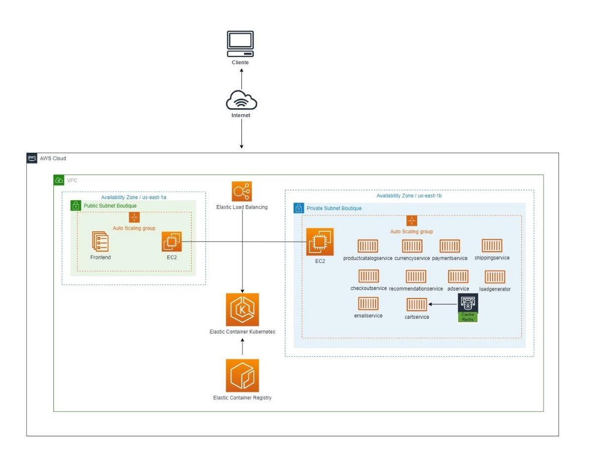
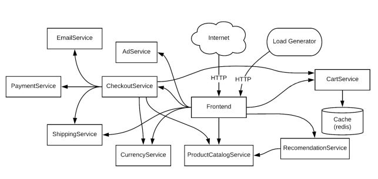

# Obligatorio 2022 - Implementacion de Soluciones Cloud
## Micaela Plada - 211319
## Diego Zignago - 204523
## Israel Bellizzi - 144606

### Presentación ejecutiva:

Se presenta una solución para modernizar y desplegar la arquitectura de "e-shop Services" a traves de un cluster EKS montado en Amazon Web Services. Se elije la siguiente arquitectura:



### Online Boutique está compuesto por 11 microservicios:


### Instrucciones de uso:

Los siguientes archivos deben estar en el mismo repositorio:

- script_microservicios.sh
- eks-cluster.tf
- *.yaml

El script de bash contiene la invocación al archivo eks-cluster.tf, quien crea toda la infraestructura necesaria para montar un cluster EKS, esto es:

- VPC
- Subnets
- Security Groups
- Internet Gateway
- Default Route Table
- Cluster EKS
- EKS Node Group

Luego el script continua realizando los 12 deployments ejecutando cada uno de los archivos yaml, en base a las siguientes imagenes de docker:

> 025891832913.dkr.ecr.us-east-1.amazonaws.com/boutique-online-adservice-isra

> 025891832913.dkr.ecr.us-east-1.amazonaws.com/boutique-online-cartservice-isra

> 025891832913.dkr.ecr.us-east-1.amazonaws.com/boutique-online-checkoutservices-isra

> 025891832913.dkr.ecr.us-east-1.amazonaws.com/boutique-online-currencyservice-isra

> 025891832913.dkr.ecr.us-east-1.amazonaws.com/boutique-online-emailservice-isra

> 025891832913.dkr.ecr.us-east-1.amazonaws.com/boutique-online-frontend-isra

> 025891832913.dkr.ecr.us-east-1.amazonaws.com/boutique-online-loadgenerator-isra

> 025891832913.dkr.ecr.us-east-1.amazonaws.com/boutique-online-paymentservice-isra

> 025891832913.dkr.ecr.us-east-1.amazonaws.com/boutique-online-productcatalogservice-isra

> 025891832913.dkr.ecr.us-east-1.amazonaws.com/boutique-online-recommendationservice-isra

> 025891832913.dkr.ecr.us-east-1.amazonaws.com/boutique-online-shippingservice-isra

### script bash:

```
#Este script debe estar en el mismo directorio que el codigo terraform, y que los archivos yaml de deployment

#Comandos terraform, toma y ejecuta el codigo escrito en el archivo: eks-cluster.tf
terraform init
terraform apply -auto-approve

#Conexion a cluster recien creado
aws eks --region us-east-1 update-kubeconfig --name oblig-online-boutique

#Se deployan el redis y el resto de los microservicios
kubectl create -f deploy-redis.yaml
sleep 5
kubectl create -f .
```

### código Terraform:

```
#Declaracion de AWS como provider
terraform {
  required_providers {
    aws = {
      source = "hashicorp/aws"
    }
  }
}

#Se crea el recurso VPC
resource "aws_vpc" "boutique-vpc" {
  cidr_block       = "172.17.0.0/16"
  instance_tenancy = "default"
  tags = {
    Name = "boutique-vpc"
  }
}

#Creacion de subnet para DMZ (frontend)
resource "aws_subnet" "boutique-public-subnet" {
  vpc_id                  = aws_vpc.boutique-vpc.id
  cidr_block              = "172.17.1.0/24"
  availability_zone       = "us-east-1a"
  map_public_ip_on_launch = true

  tags = {
    Name = "boutique-public-subnet"
  }
}

#Creacion de subnet para resto de los servicios
resource "aws_subnet" "boutique-private-subnet" {
  vpc_id                  = aws_vpc.boutique-vpc.id
  cidr_block              = "172.17.2.0/24"
  availability_zone       = "us-east-1b"
  map_public_ip_on_launch = "true"
  tags = {
    Name = "boutique-private-subnet"
  }
}

#Security group con trafico http/https
resource "aws_security_group" "boutique-sg-http" {
  name        = "boutique-sg-http"
  description = "trafico-http"
  vpc_id      = aws_vpc.boutique-vpc.id

  ingress {
    from_port   = 80
    to_port     = 80
    protocol    = "tcp"
    cidr_blocks = ["0.0.0.0/0"]
  }

  ingress {
    from_port   = 443
    to_port     = 443
    protocol    = "tcp"
    cidr_blocks = ["0.0.0.0/0"]
  }

  egress {
    from_port   = 0
    to_port     = 0
    protocol    = "-1"
    cidr_blocks = ["0.0.0.0/0"]
  }
}

#Creacion de internet gateway para entrada y salida a internet
resource "aws_internet_gateway" "internetgateway-boutique" {
  vpc_id = aws_vpc.boutique-vpc.id
}

#Se define ruta por defecto de la vpc
resource "aws_default_route_table" "routetable-boutique" {
  default_route_table_id = aws_vpc.boutique-vpc.default_route_table_id

  route {
    cidr_block = "0.0.0.0/0"
    gateway_id = aws_internet_gateway.internetgateway-boutique.id
  }
}

#Se crea cluster EKS
resource "aws_eks_cluster" "oblig-online-boutique" {
  name     = "oblig-online-boutique"
  role_arn = "arn:aws:iam::025891832913:role/LabRole"

  vpc_config {
    subnet_ids         = [aws_subnet.boutique-public-subnet.id, aws_subnet.boutique-private-subnet.id]
    security_group_ids = [aws_security_group.boutique-sg-http.id]
  }
}

#Se define Node Group y auto scaling
resource "aws_eks_node_group" "boutique-node-group" {
  cluster_name    = aws_eks_cluster.oblig-online-boutique.name
  node_group_name = "boutique-node-group"
  node_role_arn   = "arn:aws:iam::025891832913:role/LabRole"
  subnet_ids      = [aws_subnet.boutique-public-subnet.id, aws_subnet.boutique-private-subnet.id]
  instance_types  = ["t2.medium"]

  scaling_config {
    desired_size = 2
    max_size     = 8
    min_size     = 2
  }
}
```

# Detalles Técnicos

## Versión de Terraform:
- v1.2.3

## Versión de Kubectl:
- Client Version: version.Info{Major:"1", Minor:"21", GitVersion:"v1.21.13", GitCommit:"80ec6572b15ee0ed2e6efa97a4dcd30f57e68224", GitTreeState:"clean", BuildDate:"2022-05-24T12:40:44Z", GoVersion:"go1.16.15", Compiler:"gc", Platform:"linux/amd64"}
- Server Version: version.Info{Major:"1", Minor:"22+", GitVersion:"v1.22.9-eks-a64ea69", GitCommit:"540410f9a2e24b7a2a870ebfacb3212744b5f878", GitTreeState:"clean", BuildDate:"2022-05-12T19:15:31Z", GoVersion:"go1.16.15", Compiler:"gc", Platform:"linux/amd64"}

## Versión de Docker: 
- Client: Docker Engine - Community
- Cloud integration: v1.0.25
- Version:           20.10.16

- Server: Docker Desktop
- Engine:
- Version:          20.10.16

## Servicios AWS:
- VPC
- Subnets
- Security Groups
- Internet Gateway
- Default Route Table
- Cluster EKS
- EKS Node Group

# Datos de Infraestructura

## Tipo de Instancia:
- t2.medium
- Linux/UNIX
- ami-0d5cbb67678bc879c

## VPC:
- boutique-vpc
- CIDR: 172.17.0.0/16

## Subnets
- boutique-private-subnet
CIDR: 172.17.2.0/24
- boutique-public-subnet
CIDR: 172.17.1.0/24

## IGW
- VPC ID: vpc-03766f1fb14ad94e5 | boutique-vpc

## SG
- boutique-sg-http
- TCP	80
- TCP	443
